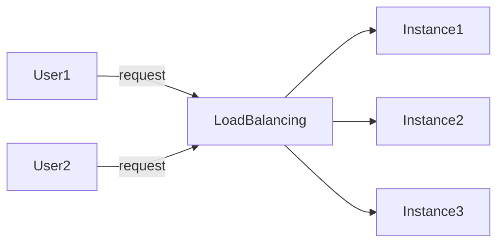

## Elastic Load Balancing Notes

La escalabilidad significa que una applicacion/sistema puede manejar mayores cargas adaptandose
Hay dos tipos de escalabilidad
-   Escalabilidad Vertical
-   Escalabilidad Horizontal( = elasticidad)

La escalabilidad esta vinculada pero es diferente a la alta disponibilidad

### Escalabilidad vertical

Significa aumentar el tamaño de la instancia, es muy comun para sistemas no distribuidos, como una base de datos.
Por lo general hay un limite en cuanto a lo que puede escala.

### Escalabilidad horizontal

Significa aumentar el numero de instancias/sistemas para la applicacion, implica sistemas distribuidos, es muy facil escalar gracias a AWS Cloud

### Ejemplo de implementacion en EC2

.

## Escalabilidad vs Elasticidad

Escalabilidad: capacidad de acomodar una mayor carga reforzando el Hw (scale up) o añadiendo nodos (scale out)

Elasticidad: una vez que un sistema es escalable, la elasticidad significa que habra cierto "autoescalado" para que el sistema pueda escalar en funcion de la carga. Esto es "amigable con el Cloud": pago por uso, adecuacion a la demanda, optimizacion de costes.

Agilidad: los nuevos recursos de IT estan a un clic de distancia, lo que significa que se reduce el tiempo para poner esos recursos a disposicion de los desarrolladores.

### Load Balancing

los Load Balancers (equilibradores de carga) son servidores que reenvian el trafico de internet a multiples servidores (Instancias EC2) en sentido descendente.

### Por que utilizar un LoadBalancer

-   Distribuir la carga entre multiples instancias descendentes
-   Exponer unico punto de acceso (DNS) en tu aplicacion
-   Manejar sin problemas los fallos de la instancias descendentes
-   Realiza comprobaciones periodicas del estado de tus instancias
-   Proporciona terminacion SSL
-   Alta disponibilidad entre zonas

### ELB

Un ELB (Elastic Load Balancer) es un Load Balancer gestionado
-   AWS garantiza su funcionamiento
-   AWS se encarga de las actualizacion
-   AWS solo proporciona unos pocos controles de configuracion

Tipos de Load Balancer ofrecidos por AWS:
-   Load Balancer de aplicaciones (solo HTTP/HTTPS) - Capa 7
-   Load Balancer de red (TCP) - Capa 4
-   Load Balancer Clasico (TCP) - Capa 4 y 7

## Auto Scaling Group

La carga de tus sitios web y aplicaciones puede cambiar, ademas de proporcionar ahorro de costes
El objetivo de un ASG es:
-   Reducir (añadir instancias de EC2) para adaptarse a un aumento de la carga
-   Aumentar (añadir instancias de EC2) para adaptarse a una disminucion de la carga
-   Asegurar un max y un min de maquinas en funcionamiento
-   Registrar nuevas instancias al LoadBalancer
-   Remplazar las instancias en mal estado

Estrategias:

-   Escalado manual: Actualizar el tamaño de un ASG manualmente
-   Escalado dinamico: Responde a los cambios en la demanda
    -   Escalado simple/ por pasos
        -   Cuando se activa una alarma de CloudWatch(CPU > 70%) se añaden 2 unidades
        -   Caundo se dispara una alarma de CloudWatch(CPU < 30%) se elimina 1 unidad
    -   Escalado de seguimiendo de objetivos
    -   Escalado Programado
-   Escalado predictivo: Utiliza machine learning para predecir el tradico futuro con antelacion, aprovisiona automaticamente el numero correcto de instancias EC2 por adelantado
  
## Resumen

.